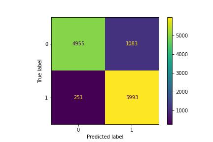
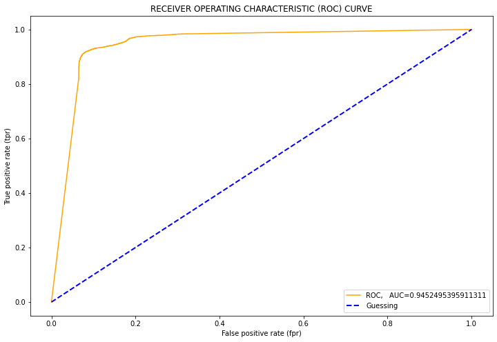
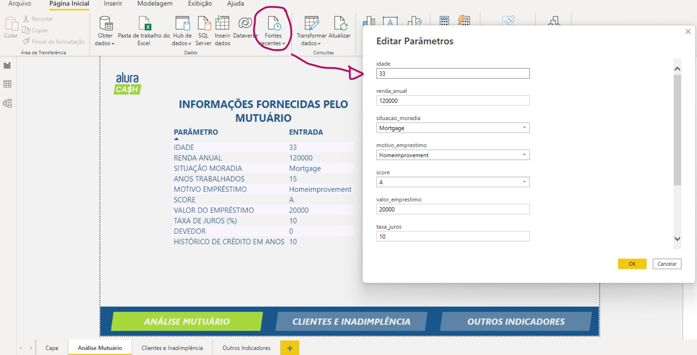
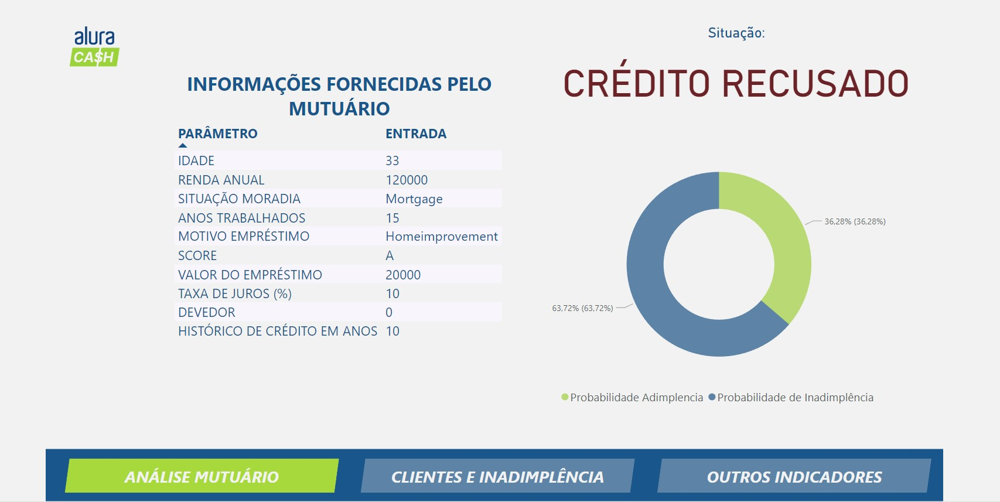
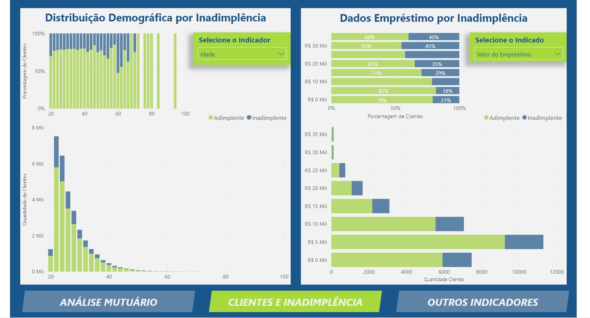
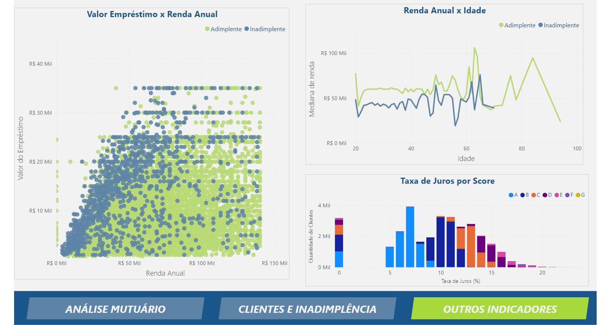

# Desafio realizado no Challenge Dados da Alura

## INFORMAÇÕES GERAIS
**EMPRESA FICTÍCIA**: banco digital internacional chamado Alura Cash

**OBJETIVO**: Diminuir as perdas financeiras por conta de pessoas mutuarias que não quitam suas dívidas.

**COMO FAZER**: Encontrar padrões para identificar os clientes que sejam potenciais inadimplentes. Para isso, deseja-se desenvolver um modelo supervisionado de **Machine Learning** para classificar os solicitantes de empréstimo que possívelmente se tornem inadimplentes e apresentar os resultados em um dashboard interativo para os tomadores de decisão. 

## 01 - Consulta e Manipulação da Base de Dados usando SQL

A empresa disponibilizou os dados referentes às informações dos clientes através de um [dump](Dados/dumps), o que possibilitou a criação de um no Banco de Dados usando o MySQL. O primeiro passo foi tratar o conjunto de dados para deixá-los padronizados no texto, bem como, corrigir inconsistências relacionadas ao tipo e estruturação. Após o tratamento dos dados, optou-se por juntar todas as tabelas conforme ID do solicitante, ID da solicitação e ID do score de cada solicitante.

O desenvolvimento desta primeira etapa está neste [script](01-Consulta-e-Manipulacao-dos-dados-no-MySQL.sql), e a partir disso todos os dados foram exportados para um único [arquivo](Dados/dados_unificados.csv) CSV.

Mais detalhes sobre as informações fornecidas estão no dicionário a seguir: 

### dados_mutuarios
Tabela contendo os dados pessoais de cada solicitante

| Feature | Característica |
| --- | --- |
|`person_id`|ID da pessoa solicitante|
| `person_age` | Idade da pessoa - em anos - que solicita empréstimo |
| `person_income` | Salário anual da pessoa solicitante |
| `person_home_ownership` | Situação da propriedade que a pessoa possui: *Alugada* (`Rent`), *Própria* (`Own`), *Hipotecada* (`Mortgage`) e *Outros casos* (`Other`) |
| `person_emp_length` | Tempo - em anos - que a pessoa trabalhou |

### emprestimos

Tabela contendo as informações do empréstimo solicitado

| Feature | Característica |
| --- | --- |
|`loan_id`|ID da solicitação de empréstico de cada solicitante|
| `loan_intent` | Motivo do empréstimo: *Pessoal* (`Personal`), *Educativo* (`Education`), *Médico* (`Medical`), *Empreendimento* (`Venture`), *Melhora do lar* (`Homeimprovement`), *Pagamento de débitos* (`Debtconsolidation`) |
| `loan_grade` | Pontuação de empréstimos, por nível variando de `A` a `G` |
| `loan_amnt` | Valor total do empréstimo solicitado |
| `loan_int_rate` | Taxa de juros |
| `loan_status` | Possibilidade de inadimplência |
| `loan_percent_income` | Renda percentual entre o *valor total do empréstimo* e o *salário anual* |

### historicos_banco

Histório de emprétimos de cada cliente

| Feature | Característica |
| --- | --- |
|`cb_id`|ID do histórico de cada solicitante|
| `cb_person_default_on_file` | Indica se a pessoa já foi inadimplente: sim (`Y`,`YES`) e não (`N`,`NO`) |
| `cb_person_cred_hist_length` | Tempo - em anos - desde a primeira solicitação de crédito ou aquisição de um cartão de crédito |

### id

Tabela que relaciona os IDs de cada informação da pessoa solicitante

| Feature | Característica |
| --- | --- |
|`person_id`|ID da pessoa solicitante|
|`loan_id`|ID da solicitação de empréstico de cada solicitante|
|`cb_id`|ID do histórico de cada solicitante|

## 02 - Modelo preditivo para classificar cliente inadimplentes

Primeiramente foi feito a limpeza e processamento dos dados, retirando valores nulos, errados e os Outliers.
Em seguida foi realizada uma análise dos dados prévia dentro do próprio notebook e os dados já tratados foram salvos em um novo [arquivo](Dados/dados_tratados.csv) que será posteriormente utilizado e apresentado no POwerBI. 

O modelo que que apresentou melhor desempenho foi o modelo que utiliza o algoritmo K Neighbors Classifier, e após ter seus hiperparametetros otimizados, apresendou as seguintes métricas:

| Métrica | Linha de Base - Dummy Classifier | Modelo KNN Otimizado |
| --- | --- | --- |
| Acurácia | 49,98% | 89,13%|
| Precisão | ... | 84,69%|
| Sensibilidade | ... | 95,98%|
| F1 | ... | 89,98%|

MATRIZ CONFUSÃO:

CURVA ROC E AUC:

O desenvolvimento do modelo está neste [notebook](2-Machine-Learning-para-Classificacao-de-Inadimplentes.ipynb).

## 03 - API para rodar o modelo e classificar novos clientes

A terceira etapa deste projeto foi desenvolver um API usando o **FastAPI** caqpz de rodar o modelo desnvolvido e classificar um novo cliente mutuário como possível inadimplente ou adimplente. 
O código do API está disponível neste [arquivo](03-APIPowerBI.py).

## 04 -  Dashboard interativo no Power BI

Por fim, foi desenvolvido um dashboard interativo no qual é possível incluir o dados de um novo cliente em forma de parâmetros, e uma vez que o PowerBI esteja conectado ao API e online, o dashboard irá retornar se este novo cliente solicitante  terá o emprestimo liberado ou negado, e qual a probabilidade calculada deste cliente ser adimplente ou inadimplente, como segue o exemplo: 

Além disso, o dashboard também apresenta gráficos com os dados extraídos da base de dados inicialmente, os quais foram utilizados para treinar e testar o modelo de preditivo.

O dashboard interativo pode ser acessado por [aqui](https://app.powerbi.com/view?r=eyJrIjoiOWNlMWEwNjAtNTQ5MC00ZDY1LWIzNmUtOGYzMzNlODVkZDQzIiwidCI6ImMwMGMyNzg3LTI3NmItNDE4ZC1iZjFjLTFkOTVhNDY3NTZjZSJ9&pageName=ReportSection) e este é o [arquivo](04-Visualizacao-dados-e-Previsao-de-inadimplencia.pbix) editável do PowerBI.

